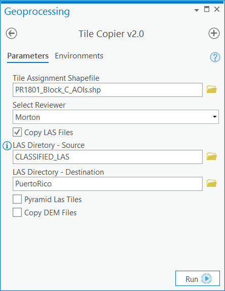

Tile Copier
-----------

Tile Copier copies to a local directory the LAS and/or DEM files associated with the tiles assigned to the specified reviewer. The list of available reviewers is read from the "Reviewer" attribute in specified tile-assignment shapefile.

NOTE:  Tile Copier v2.0 is compatible with both ArcMap and ArcPro, but future versions will work with ArcPro only.

